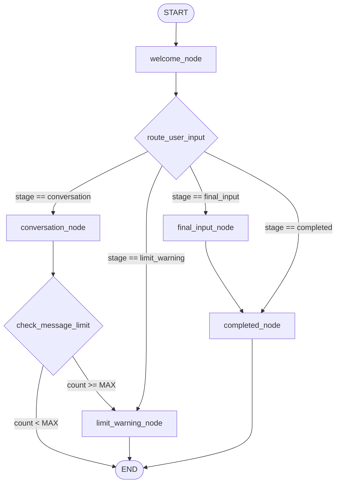

# LangGraph Conversion Guide: AI Agentic Conversational Chatbot

This guide outlines how to build and develop the same Multi-Agent Lead Qualification Chatbot using **LangGraph**. It maps the existing code-driven stage orchestrator to a state-graph topology while preserving all business rules, data extraction logic, RAG pipelines, and API patterns.

---

## Application Summary

The application is an **AI-powered Multi-Agent Lead Qualification Chatbot** designed for corporate websites to interact with visitors, answer queries, extract business requirements, and capture verified leads.

### Core Features & Behaviors
1. **Multi-Tenant Knowledge Base (RAG)**: The chatbot uses **Pinecone** partitioned by unique namespaces. When a user chats with the widget on a client site, the backend queries only the RAG files ingested under that client's specific namespace.
2. **Intent-Driven Natural Conversation**:
   * **Question Mode**: Prioritizes answering visitor questions using retrieved RAG context.
   * **Data Extraction Mode**: Naturally extracts client info (Name, Email, Company, Location), project type, tech stack, and scope constraints without forcing a rigid step-by-step form.
3. **Conversational Guardrails & Rules**:
   * **Absolute Off-Topic Filter**: Catches off-topic questions (e.g., weather, generic math, bot identity) using regex interceptors to save API costs.
   * **Strict Budget Redirection**: Never quotes prices or answers budget estimates directly; it intercepts budget-related keywords and redirects them to a human rep message.
   * **Contact Nudges**: Gently prompts the user with missing details (like Name or Email) right before the message limit is reached.
4. **Session Controls & Limits**: Enforces a configurable message limit (`MAX_USER_MESSAGES`) per visitor session to manage API budgets, warning users when they reach the limit.
5. **Background Lead Delivery**:
   * **Summarization Agent**: Generates a professional requirements list and lead summary from the conversation logs.
   * **Email Agent**: Automatically triggers notification emails to both the business admin (lead details) and the visitor (thank you email) when the session finishes.
6. **Auxiliary PDF Ingestion & YouTube Extractors**: Features endpoints to ingest document folders and automatically extract transcripts from YouTube video links to construct RAG documents.

---

## 1. Architectural Mapping

In LangGraph, the agent system is represented as a **StateGraph**. The current custom orchestrator logic translates into nodes, state objects, and conditional edges as follows:

| Current Component | LangGraph Component | Role in LangGraph |
| :--- | :--- | :--- |
| `MemoryStore` | `StateGraph` Checkpointer | Persists conversation states using unique thread/session IDs. |
| `Session` | `AgentState` (TypedDict) | The shared global memory passed between nodes. |
| `orchestrator._handle_welcome` | `welcome` node | Sends the initial welcome message and updates state. |
| `conversation_agent.py` | `conversation` node | Evaluates input, queries RAG (Pinecone), runs extraction, and updates collected data. |
| `orchestrator._handle_limit_warning` | `limit_warning` node | Asks if the user wants to submit final details when `MAX_USER_MESSAGES` is hit. |
| `orchestrator._handle_final_input` | `final_input` node | Captures the final data message from the user. |
| `orchestrator._handle_completed` | `completed` node | Runs summarization and triggers the email dispatch. |
| Stage transition conditionals | `Conditional Edges` | Routes flow dynamically based on message counts, stage variables, and user input. |

---

## 2. Graph State Definition (`AgentState`)

The state represents the single source of truth passed between nodes. It must track the conversation stage, collected lead details, and chat counters.

```python
from typing import Annotated, Dict, Any, List
from typing_extensions import TypedDict
from pydantic import BaseModel, Field

# Match your existing collected data schema
class PersonalInfo(BaseModel):
    name: str = ""
    email: str = ""
    company: str = ""
    location: str = ""

class TechDiscovery(BaseModel):
    project_type: str = ""
    tech_stack: str = ""
    features: str = ""
    integrations: str = ""

class ScopePricing(BaseModel):
    budget: str = ""
    timeline: str = ""
    mvp_or_production: str = ""
    priority_features: str = ""

class CollectedData(BaseModel):
    personal_info: PersonalInfo = Field(default_factory=PersonalInfo)
    tech_discovery: TechDiscovery = Field(default_factory=TechDiscovery)
    scope_pricing: ScopePricing = Field(default_factory=ScopePricing)

class AgentState(TypedDict):
    # Core state
    session_id: str
    namespace: str
    company_name: str
    stage: str  # "welcome" | "conversation" | "limit_warning" | "final_input" | "completed"
    
    # Message logs
    messages: List[Dict[str, str]]  # list of {"role": "...", "content": "..."}
    user_message_count: int
    
    # Lead details
    collected_data: CollectedData
    
    # Output properties
    reply: str
    data_collected: Dict[str, Any]
```

---

## 3. Graph Topology

The flowchart below represents the LangGraph topology. Nodes perform execution steps, and conditional edges route flow dynamically.



---

## 4. Nodes Implementation Details

Each node is a Python function that takes the current state and returns an updated dictionary of modified state values.

### Node A: `welcome_node`
Called if the session is new. It outputs the welcome response and moves the stage to `"conversation"`.
```python
async def welcome_node(state: AgentState) -> Dict[str, Any]:
    company_name = state["company_name"]
    welcome_msg = f"Hello! 👋 I'm your project consultant at {company_name}. How can I assist you with your project details today?"
    
    return {
        "reply": welcome_msg,
        "stage": "conversation",
        "messages": state["messages"] + [{"role": "assistant", "content": welcome_msg}]
    }
```

### Node B: `conversation_node`
Performs the core business logic. Must preserve:
1. **Absolute Off-Topic Filter**: Detect bot questions, weather, time, and math via regex. If matched, skip the LLM call and return a polite redirection text.
2. **Strict Budget Rule**: Intercept questions containing budget/pricing keywords and reply with exactly: *"Our team will reach out and discuss about the budget with you."*
3. **Contact Info Intercept**: Intercept questions asking how to contact the team and reply with a domain-specific email (e.g. `info@namespace.com`).
4. **RAG Context**: Compute semantic vectors of the user message and query Pinecone using the `state["namespace"]` partition to construct the prompt context.
5. **LLM Structured Generation**: Pass the system instructions, RAG context, and conversation history to the LLM to get a JSON output containing `{"response": "...", "extracted_data": {...}}`.
6. **Regex Fallbacks & Validation**: If parsing fails or fields are missed, run regex fallback to extract emails/names. Clean data values before saving.
7. **Contact Nudge**: At message index 4 (one step before max limit), append a list of missing fields (Name, Email, etc.) via code.

```python
async def conversation_node(state: AgentState) -> Dict[str, Any]:
    user_msg = state["messages"][-1]["content"]
    messages = state["messages"]
    
    # 1. Off-Topic Check
    if is_off_topic(user_msg):
        reply = get_default_redirect(state["company_name"])
        return {
            "reply": reply,
            "messages": messages + [{"role": "assistant", "content": reply}]
        }
        
    # 2. Budget Rule
    if is_budget_query(user_msg):
        reply = "Our team will reach out and discuss about the budget with you."
        return {
            "reply": reply,
            "messages": messages + [{"role": "assistant", "content": reply}]
        }
        
    # 3. RAG Query
    rag_context = await query_pinecone(user_msg, namespace=state["namespace"])
    
    # 4. LLM Generation & Data Extraction
    system_prompt = build_system_prompt(state, rag_context)
    llm_output = await call_llm(system_prompt, messages)
    
    reply, extracted_data = parse_and_validate(llm_output, user_msg)
    
    # 5. Save Data and Increment Counters
    updated_data = merge_collected_data(state["collected_data"], extracted_data)
    
    # 6. Apply Nudge at index 4
    if state["user_message_count"] == 4:
        nudge = build_nudge_prompt(updated_data)
        if nudge:
            reply += f"\n\n{nudge}"
            
    return {
        "reply": reply,
        "collected_data": updated_data,
        "messages": messages + [{"role": "assistant", "content": reply}],
        "user_message_count": state["user_message_count"] + 1
    }
```

### Node C: `limit_warning_node`
Warns the user they have reached their message capacity. Sets state stage to `"final_input"`.
```python
async def limit_warning_node(state: AgentState) -> Dict[str, Any]:
    warning = (
        "We've reached our conversation limit for this session. "
        "Would you like to provide any final requirements or contact details before we submit? (Yes/No)"
    )
    return {
        "reply": warning,
        "stage": "final_input",
        "messages": state["messages"] + [{"role": "assistant", "content": warning}]
    }
```

### Node D: `final_input_node`
Evaluates the final input. If the user provided requirements, performs a final extraction run. Then sets stage to `"completed"`.
```python
async def final_input_node(state: AgentState) -> Dict[str, Any]:
    user_msg = state["messages"][-1]["content"]
    
    if user_msg.strip().lower() in ["no", "no thanks", "stop"]:
        reply = "Thank you! I have closed this session. Our team will reach out to you shortly."
        return {
            "reply": reply,
            "stage": "completed",
            "messages": state["messages"] + [{"role": "assistant", "content": reply}]
        }
        
    # Extract final requirements
    extracted_data = await extract_data_single_pass(user_msg)
    updated_data = merge_collected_data(state["collected_data"], extracted_data)
    
    reply = "Thank you for the details! We have saved everything and our team will get in touch soon."
    return {
        "reply": reply,
        "collected_data": updated_data,
        "stage": "completed",
        "messages": state["messages"] + [{"role": "assistant", "content": reply}]
    }
```

### Node E: `completed_node`
Performs background operations.
```python
async def completed_node(state: AgentState) -> Dict[str, Any]:
    # Run async background processes: Summarization Agent & Email Agent
    # Skip email if email is missing.
    if state["collected_data"].personal_info.email:
        asyncio.create_task(run_summary_and_email_agents(state))
        
    return {
        "reply": "Session is closed.",
        "stage": "completed"
    }
```

---

## 5. Flow Routing (Conditional Edges)

Conditional routing handles navigation based on user message inputs and state variables.

```python
def route_user_input(state: AgentState) -> str:
    """Routes initial execution flow depending on the stage of the conversation."""
    return state["stage"]

def check_message_limit(state: AgentState) -> str:
    """Checks if the user has reached their message limit."""
    if state["user_message_count"] >= MAX_USER_MESSAGES:
        return "limit_warning"
    return "end"
```

---

## 6. Graph Compilation and Checkpointing

Use LangGraph's standard compilation with a checkpointer (e.g., `MemorySaver`) for in-memory session persistence:

```python
from langgraph.checkpoint.memory import MemorySaver
from langgraph.graph import StateGraph, END

# Initialize Graph
builder = StateGraph(AgentState)

# Add Nodes
builder.add_node("welcome", welcome_node)
builder.add_node("conversation", conversation_node)
builder.add_node("limit_warning", limit_warning_node)
builder.add_node("final_input", final_input_node)
builder.add_node("completed", completed_node)

# Set Entrance Point
builder.set_conditional_entry_point(
    route_user_input,
    {
        "welcome": "welcome",
        "conversation": "conversation",
        "limit_warning": "limit_warning",
        "final_input": "final_input",
        "completed": "completed"
    }
)

# Define Graph Flows
builder.add_edge("welcome", END)

builder.add_conditional_edges(
    "conversation",
    check_message_limit,
    {
        "limit_warning": "limit_warning",
        "end": END
    }
)

builder.add_edge("limit_warning", END)
builder.add_edge("final_input", "completed")
builder.add_edge("completed", END)

# Compile Graph with Memory Checkpointer for session management
checkpointer = MemorySaver()
compiled_graph = builder.compile(checkpointer=checkpointer)
```

---

## 7. FastAPI Integration (`/api/chat` Route)

In your API endpoint, use `session_id` as the LangGraph checkpoint `thread_id`.

```python
from fastapi import APIRouter, HTTPException
from models.schemas import ChatRequest, ChatResponse

router = APIRouter()

@router.post("/api/chat", response_model=ChatResponse)
async def chat_endpoint(request: ChatRequest):
    session_id = request.session_id
    user_msg = request.message
    namespace = request.namespace or "default"
    
    # Configure the LangGraph checkpointer thread
    config = {"configurable": {"thread_id": session_id}}
    
    # 1. Fetch current state from graph database
    current_state = await compiled_graph.aget_state(config)
    
    # If session is new, initialize variables
    if not current_state.values:
        initial_state = {
            "session_id": session_id,
            "namespace": namespace,
            "company_name": format_company_name(namespace),
            "stage": "welcome",
            "messages": [],
            "user_message_count": 0,
            "collected_data": CollectedData(),
            "reply": "",
            "data_collected": {}
        }
        # Run graph through welcome node
        new_state = await compiled_graph.ainvoke(initial_state, config)
        return ChatResponse(
            reply=new_state["reply"],
            stage=new_state["stage"],
            data_collected=serialize_data(new_state["collected_data"])
        )
        
    # 2. Append new user message to existing history state
    updated_messages = current_state.values["messages"] + [{"role": "user", "content": user_msg}]
    
    # 3. Invoke graph to process the new message input
    updated_state = await compiled_graph.ainvoke(
        {"messages": updated_messages},
        config
    )
    
    return ChatResponse(
        reply=updated_state["reply"],
        stage=updated_state["stage"],
        data_collected=serialize_data(updated_state["collected_data"])
    )
```

---

## 8. Preserving Auxiliary Endpoints & Commands

You must carry over these existing systems completely:
*   **Session Reset/Exit (`POST /api/reset` & `POST /api/exit`)**: Reset deletes the LangGraph thread state by clearing checkpoint entries or writing an empty dictionary. Exit updates `stage` directly to `"completed"` and runs `completed_node`.
*   **Admin Pinecone Ingestion (`POST /api/admin/ingest`)**: Run file ingestion scans over the backend documents folders, chunk PDF files using `PyMuPDF`, generate vectors, and upload to Pinecone indexed by namespace.
*   **YouTube Extraction Tool (`POST /api/admin/extract-youtube`)**: Keep the `youtube-transcript-api` extraction script to extract subtitles, convert transcripts to PDFs using `fpdf2`, and dump them inside the ingestion folder.
